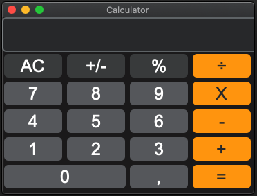

# GUI_Calculator
Repo for building a calculator GUI using customtkinter
[](https://www.linkedin.com/in/kristoffer-hallam-0200a236/) [](https://www.python.org/downloads/release/python-365/) [](https://github.com/carlosfab/data_science/issues)

<p align="left">
  
</p>

## Project:

* ### **GUI Calculator**
Modern GUI simulating a calculator.

#### Installation
```bash
pip install customtkinter
```

<p align="center">
  
</p>
